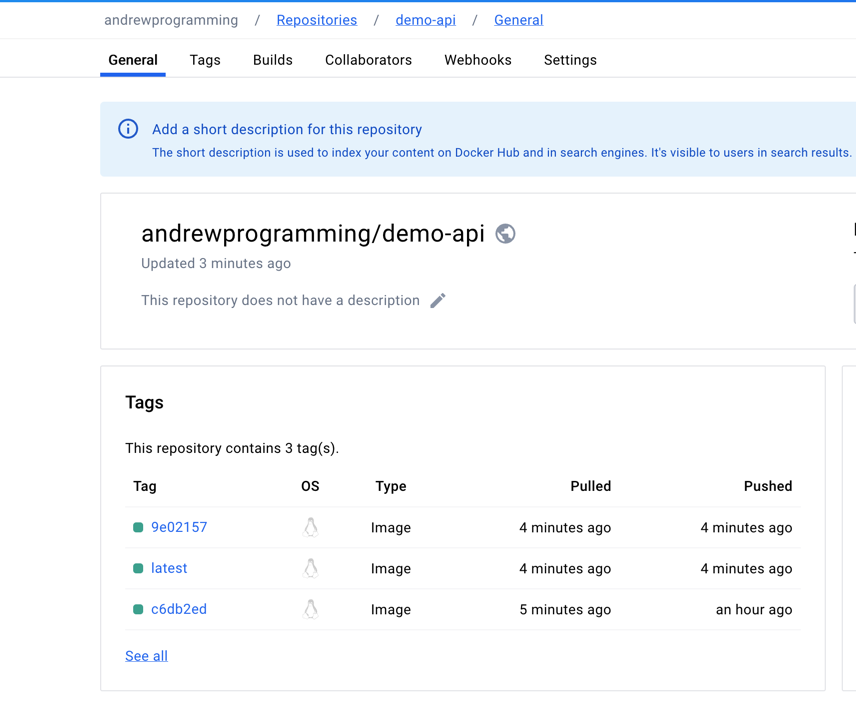
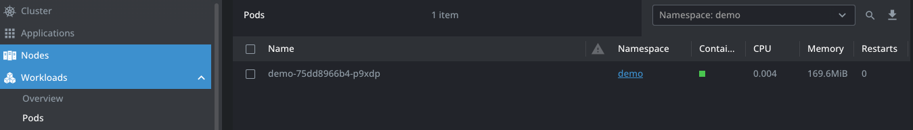
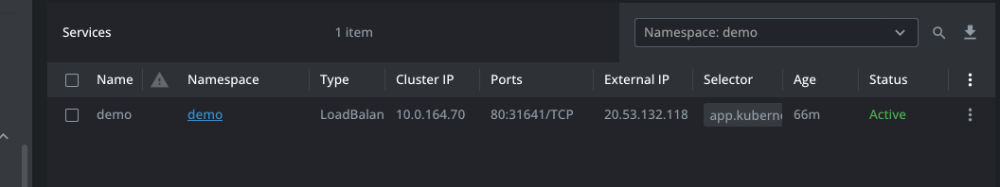
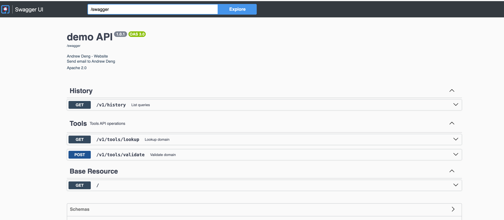
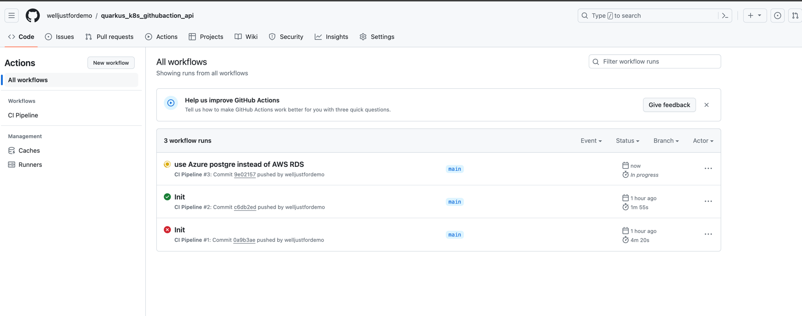
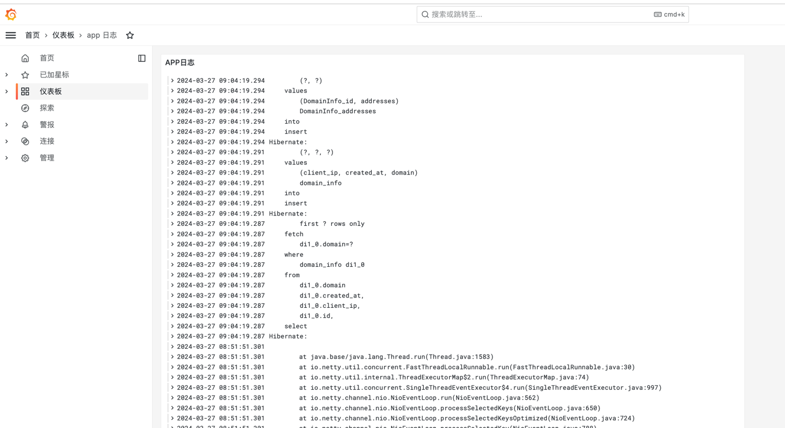
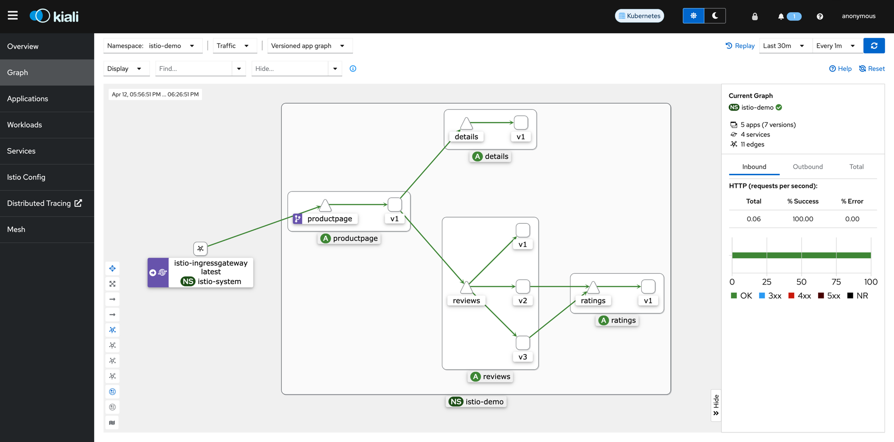

# demo interview api

## How it works ?

### Tech stack

- JDK 21
- [Quarkus](https://quarkus.io/) (Framework)

- Docker / [DokcerHub](https://hub.docker.com/repository/docker/andrewprogramming/demo-api/general) / Docker Compose(Dev environment)
- K8s (Production)
- Azure LoadBalancer
- AWS RDS PostgreSQL

### PS

- This project uses Quarkus, the Supersonic Subatomic Java Framework. If you want to learn more
  about Quarkus, please visit its website: https://quarkus.io/ .
- Two docker images will be build : **latest** and **github commit hash tag (eg. 8ff8bed)**


https://hub.docker.com/repository/docker/andrewprogramming/demo-api/general

## How to start

### Start Locally (Dev Env) ###

#### Prerequest

- Docker / Docker Compose

**Two options:**

**Option 1**

Start database locally using `docker-compose up -d --build` , make sure run this command in root
folder

**Option 2**

**Prerequest:**

- JDK 21

```yaml
docker-compose -f docker-compose-dev.yaml up
```

 ```yaml
./mvnw quarkus:dev -Dquarkus.profile=dev -Dquarkus.container-image.build=false -Dquarkus.container-image.push=false
 ````

### Start in Production (Prod Env)
**PS: This project already deployed in AKS (Azure Kubernetes Service) and keep available during the interview period**
- CI/CD is implemented using GithubAction and pipeline script is
  here: [ci.yml](.github%2Fworkflows%2Fci.yml)
- All you need to do is submit your code and merge it to `main` branch , pipeline will trigger
  automatically [Pipeline Link](https://github.com/welljustfordemo/quarkus_k8s_githubaction_demo/actions)
- Visit services by using Azure LoadBalancer IP (4.147.249.188), for
  example : http://20.53.132.118/v1/history

- 
In case you want to deply it in K8s you can run below command:
```yaml
kubectl apply -f target/kubernetes/kubernetes.yml -n demo 
```
And also if you want to test my CI/CD implementation just make change and push to main branch and wait for pipeline finish to see the result


### Visit swagger UI


- http://localhost:3000/swagger-ui/ (Dev)
- http://20.53.132.118//swagger-ui/ (Prod)

### Tools ###
http://localhost:3000/q/dev-ui/continuous-testing

### CI/CD

- By leverage the power of Quarkus framework , CI/CD can be easily implemented with GithubAction ;
- Most of the cases HELM with FluxCD or ArgoCD maybe a better option for GitOps implementation then
  Kubernetes manifests but for this case due to the limitation of time and the great advantage of
  Quarkus , Kubernetes manifests is choosed
  
### Monitoring
Use loki-stack for monitoring
```yaml
## install loki-stack
helm search repo loki
helm show values grafana/loki-stack>k8s/values.yaml
helm install --values values.yaml loki grafana/loki-stack -n loki-stack --create-namespace

## get grafana admin user password
kubectl get secret -n loki-stack loki-grafana \
-o jsonpath="{.data.admin-password}" | \
base64 --decode ; echo

## port forwarding of grafana
kubectl port-forward svc/loki-grafana 3000:80 -n loki-stack
```


### Configure Ingress
```yaml
kubectl get pods --all-namespaces | grep ingress

helm repo add ingress-nginx https://kubernetes.github.io/ingress-nginx
helm repo update
helm install ingress-nginx ingress-nginx/ingress-nginx --create-namespace --namespace ingress-nginx

### Check Ingress pod status
kubectl get pods -n ingress-nginx
### check if Service assigned with external IP
kubectl get svc -n ingress-nginx

### Debug Ingress
kubectl logs -n ingress-nginx -l app.kubernetes.io/name=ingress-nginx


```
## Next Step

- Implement GitOps best practise with ArgoCD / FluxCD
- Implement Security with OPA and Gatekeeper / Azure Sentinel, Defender
- Implement Service Mesh with Istio
- Implement CI/CD with Jenkins / GitLab CI / CircleCI
- Implement Log Management with ELK / Splunk
- Integrate with Slack / Microsoft Teams for notification
- Integrate with JIRA / Trello for project management
- Integrate with SonarQube for code quality
- Integrate with Artifactory / Nexus for artifact management
- Integrate with Sentry

## Note ##

### Start dev model with production configuration

```
./mvnw quarkus:dev -Dquarkus.profile=prod
```

### Build production image and push to dockerhub locally

if you want to build locally ,make sure docker login locally and follow below procedure

```
docker login
./mvnw package -Dquarkus.profile=prod
kubectl apply -f target/kubernetes/kubernetes.yml -n demo  
```

### Database credential stored in K8s

```yaml
kubectl create secret generic demo-db-credentials \
  --from-literal=username='demoadmin' \
  --from-literal=password='gasdfa@#$gadg' \
  -n demo
```

### Create namespace in K8s

```yaml
kubectl create namespace demo
```

## Issues
- My mac is ARM so docker image cannot be used on Linux


## Install Ingress Controller
https://kubernetes.github.io/ingress-nginx/deploy/
kubectl port-forward --namespace=ingress-nginx service/ingress-nginx-controller 8081:80

curl --resolve demo.localdev.me:8081:127.0.0.1 http://demo.localdev.me:8081


## Mis
Quarkus configurations: https://quarkus.io/guides/all-config

## How to expert values.yaml for a release , eg. sonarqube
```yaml
helm get values sonarqube -n sonarqube --all> sonarqube-values.yaml
### upgrade sonarqube
helm upgrade sonarqube sonarqube/sonarqube -n sonarqube -f helm/charts/sonarqube-values.yaml
```

## Istio

**Installation guide:** https://istio.io/latest/docs/setup/getting-started/

**PS:** Use different namespace called `istio-demo` instead of `default` which used in the office guid
so just add -n after the command, for instance `kubectl apply -f samples/bookinfo/platform/kube/bookinfo.yaml -n istio-demo`

Demo application address : http://4.147.234.43/productpage
```yaml


## Installed Charts
| Release Name | Namespace  | Chart | Version     | App Version | Status   |
|--------------|------------|-------|-------------|-------------|----------|
| sonarqube    | sonarqube  | sonarqube | 10.4.1+2389 | 10.4.1      | Deployed |
| loki         | loki-stack | loki-stack| 2.10.2      | 2.9.3       | Deployed |
| prometheus-operator | default    | kube-prometheus-stack | 57.1.1      | 0.72.0      | Deployed |
| ingress-nginx | ingress-nginx | ingress-nginx | 4.10.0      | 1.10.0      | Deployed |
